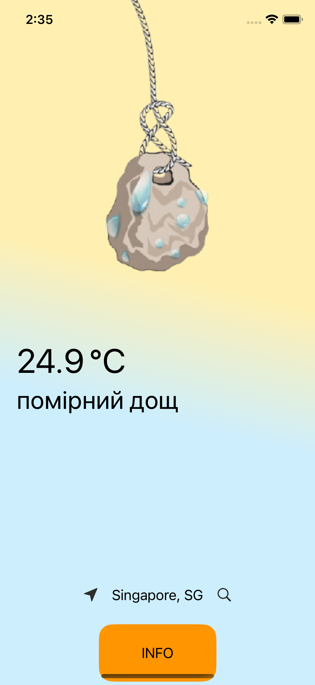
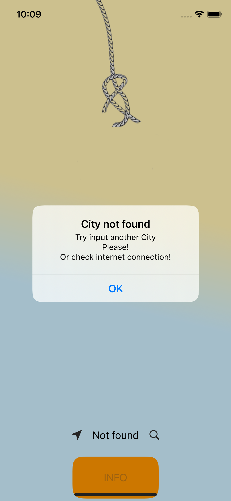
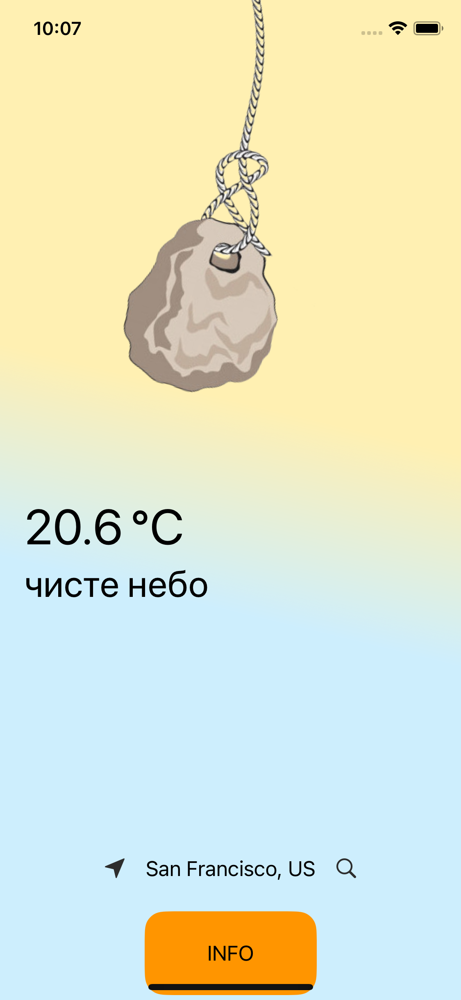
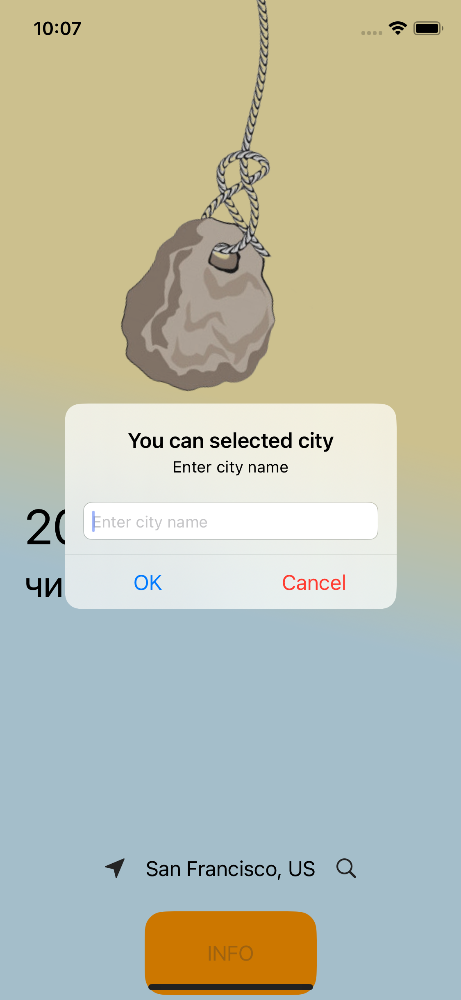
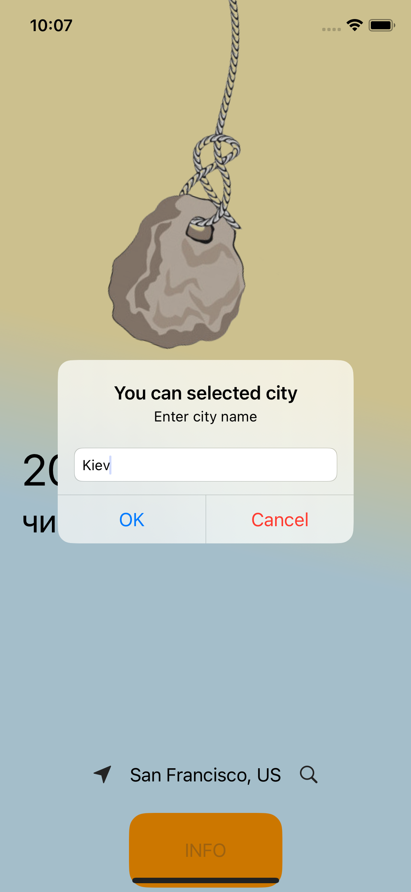
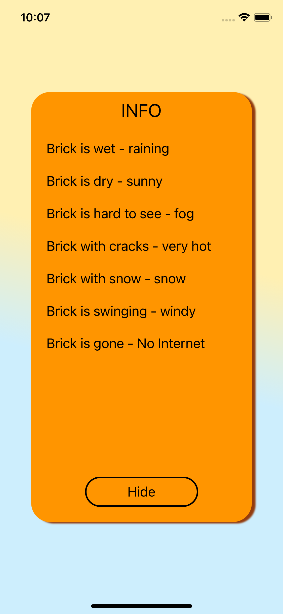

# Image Search App
A program for searching and viewing pictures from the network and your own photo gallery 
with the possibility of cropping them and saving the processed files to 
a crop folder in the gallery.

## Content
- [Technologies](#technologies)
- [Additionally](#additionally)
- [Screenshots](#screenshots)
- [Contributing](#contributing)

## Technologies
- Swift
- UIKit
- Code-only layout
- Auto Layout
- WebKit
- MVC
- Without storyboard
- JSON
- SPM TOCropViewController
- Fork (Customize TOCropViewController)
- CollectionViews

## Additionally
As an addition, a crop was customized to save the visual continuation of the project 
with the ability to select a new image from any of the application screens. 
Saving the processed files to a crop folder in the gallery.
(as in the screenshot below)

  

It is also possible to view the selected image in the maximum resolution.(as in the screenshot below)

 

## Screenshots:

   

  

## Contributing
If you find a bug or remark in the code or when the program is running, please email me:
<a href="mailto:olga.sabadina@icloud.com">olga.sabadina@icloud.com</a>

### Why did I write this project?
___
This app was developed with the help of the knowledge gained during the mentoring course on [Foxminded](https://foxminded.ua)  Swift

