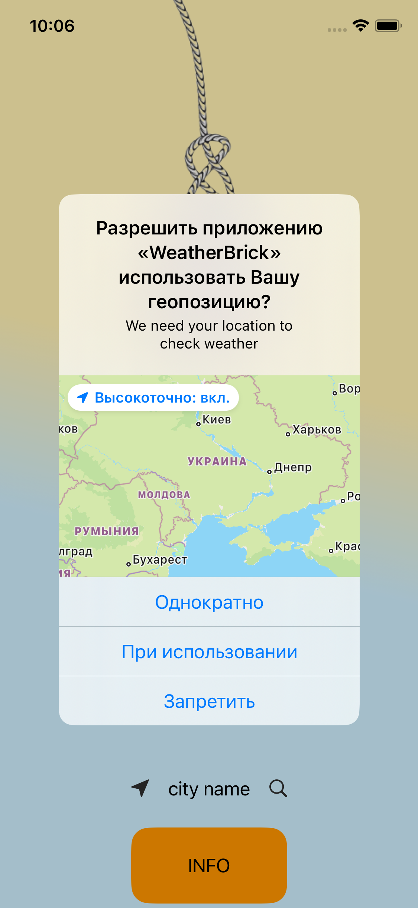
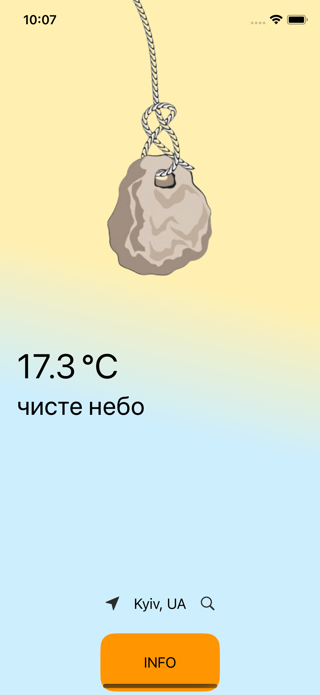

# Weather Brick App
This is a real time weather viewer.

## Content
- [Technologies](#technologies)
- [Additionally](#additionally)
- [Screenshots](#screenshots)
- [Contributing](#contributing)

## Technologies

Storyboard
URLSession
Codable
Gesture Recognizers
MVC
Third-party API
Design instruments: Figma

- Swift
- UIKit
- Code-only layout
- Auto Layout
- WebKit
- MVC
- Storyboard
- URLSession
- Codable
- Gesture Recognizers

## Additionally
as a supplement, the change in the state of the stone depending on the weather (dry, rain, snow, wind) has been worked out. 
The search goes both by the current geo-position and by the name of the city.
(as in the screenshot below)

  

## Screenshots:
   

  

## Contributing
If you find a bug or remark in the code or when the program is running, please email me:
<a href="mailto:olga.sabadina@icloud.com">olga.sabadina@icloud.com</a>

### Why did I write this project?
___
This app was developed with the help of the knowledge gained during the mentoring course on [Foxminded](https://foxminded.ua)  Swift

